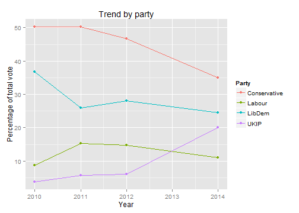

## Brentwood Elections

1. The borough of Brentwood is in Essex, England.   It sits just outside London, and is mostly bordered on the West
side by the M25 ring road.
2. Elections for the Borough Council are held three out of every four years (the fourth year is for Essex County Council)
3. This Coursera project uses the election data to produce graphs of the election results.


--- .class #id 

## The application.

I have compiled a set of data for the local election results held in 2010, 2011, 2012 and 2014 (the County Council elections were held in 2013).   This is used as the basis of the presentation.  The data is in CSV format and is
easily loaded. The data shows each ward, the year of the election, the candidates, party and total votes cast.


```r
electiondata <- read.csv("BrentwoodElections.csv", header=TRUE)
head(electiondata)
```

```
##   Year            Ward               Name        Party Vote
## 1 2012 Brentwood North        Ross Carter       LibDem  810
## 2 2012 Brentwood North      Paul Faragher Conservative  439
## 3 2012 Brentwood North  Kenneth Gulleford         UKIP  104
## 4 2012 Brentwood North   Richard Millwood       Labour  170
## 5 2012 Brentwood South       David Bishop Conservative  594
## 6 2012 Brentwood South Juliette Morrissey       Labour  689
```

---

## Where to find the source code and data.

1.  The application is hosted at https://thomasbridge.shinyapps.io/BrentwoodElections/
2.  The github repository is hosted at https://thomasbridge.shinyapps.io/BrentwoodElections/

## Summarizing the data

The application offers two main features.

1. The presentation of the results for a selected year.
2. A graph showing the trends for each party over the years contained within the data set.

The code makes no assumptions about the contents of the data - meaning adding results for different years, wards and 
parties is trivial.

There are two functions that are used in the application, yearly_summary() and create_plot().  


--- &twocol

## Features.


```r
parties <- c("Conservative", "LibDem", "UKIP", "Labour")
```

*** {name: left}


```r
yearly_summary("2012", parties)
```

```
##           Party Year votes   percent
## 4  Conservative 2012  8127 46.701529
## 21       LibDem 2012  4869 27.979543
## 17       Labour 2012  2558 14.699460
## 26         UKIP 2012  1050  6.033789
```


*** {name: right}


```r
create_plot(parties)
```

 


